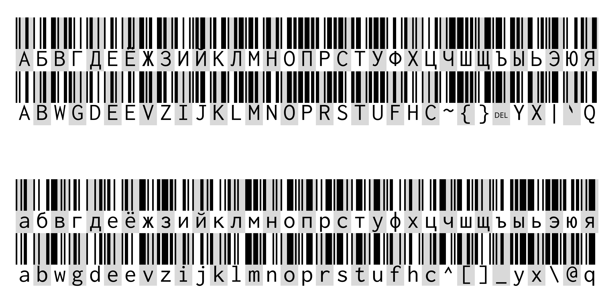

A fork of [Libre Barcode](https://github.com/graphicore/librebarcode) with extra glyph sets for Code 128.

Intended for decorative purposes only, since there are no actual standards for non-ASCII barcode symbols and no scanner software will be able to work with this.

Glyph sets added:
- Cyrillic.

  The barcode patterns are taken from standard ASCII symbols, using mappings from [KOI-7](https://en.wikipedia.org/wiki/KOI-7). So, for example, letter Г uses the pattern for G, З uses Z, etc. That way the barcode remains kind of usable, the text will just be encoded in KOI-7.

  

The original Libre Barcode uses [Inconsolata](https://levien.com/type/myfonts/inconsolata.html) as the text-below font. This fork uses [Inconsolata LGC](https://github.com/MihailJP/Inconsolata-LGC).

---

# Libre Barcode Font Project

Fonts to write barcodes.

[Manual Pages](https://graphicore.github.io/librebarcode/)

## Code 39

* Libre Barcode 39
* Libre Barcode 39 Text
* Libre Barcode Extended 39
* Libre Barcode Extended 39 Text

[Code 39 manual](https://graphicore.github.io/librebarcode/documentation/code39)

## Code 128

* Libre Barcode 128
* Libre Barcode 128 Text

[Code 128 manual](https://graphicore.github.io/librebarcode/documentation/code128)

## EAN 13 (EAN 8, UPC-A, UPC-E, 2- and 5-digit Add-Ons)

* Libre Barcode EAN13 Text

[EAN 13 manual](https://graphicore.github.io/librebarcode/documentation/ean13)


## How to install and build

You'll need `git`, `bash`, `python3.6`, `node`(=nodejs e.g. v14.13.1 is confirmed to work, use `nvm` to manage node versions) with `npm`, `bower` and `ttfautohint` (if not in your distribution I suggest: [ttfautohint-build](https://github.com/source-foundry/ttfautohint-build)). Maybe you'll have to install the `python3-venv` module.

Are dependencies missing? Please, let me know.


```
# fetch the sources
path/to $ git clone git@github.com:graphicore/librebarcode.git
path/to $ cd librebarcode

# best start with an virtual environment
path/to/librebarcode $ python3 -m venv venv
path/to/librebarcode $ . venv/bin/activate

# installs fontmake and fontbakery
(venv) path/to/librebarcode $ pip install -r requirements.txt

# installs javascript dependencies
(venv) path/to/librebarcode $ npm install
(venv) path/to/librebarcode $ bower install

# now build:
(venv) path/to/librebarcode $ ./app/bin/buildAll

# the fonts should be in the librebarcode/fonts directory now
# The UFO sources should be in the sources directory
```

## Licensing

The fonts are licensed under OFL.<br />
The barcode font generators and encoders are GPL3+.
